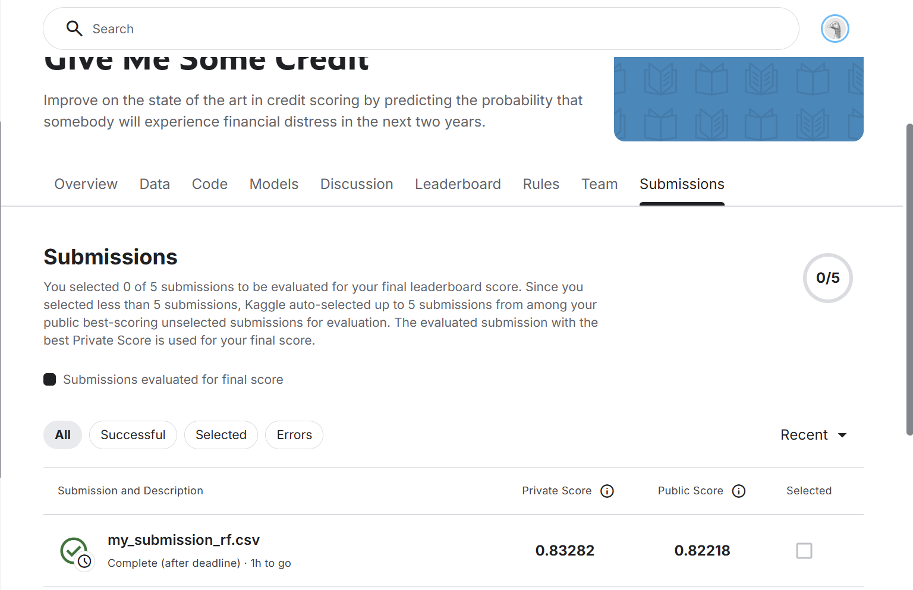

# Bank Kredit Skoring Tizimi

Ushbu loyiha Random Forest algoritmi yordamida mijozlarning kredit tarixini tahlil qiluvchi va kredit ajratish xavfini (Probability of Default) baholovchi web-ilova.

## Asosiy imkoniyatlar
- Mijozning yoshi, daromadi va qarz yukini tahlil qilish.
- 90+ kunlik kechikish tarixi mavjud bo'lgan mijozlarni avtomatik rad etish (Hard Rules).
- Random Forest modeli yordamida xavf darajasini ehtimollik bilan aniqlash.

## 📊 Model samaradorligi
Ushbu model Kaggle'ning "Give Me Some Credit" musobaqasida sinovdan o'tkazilgan va quyidagi natijalarni qayd etgan:

- **Metrika:** AUC-ROC
- **Natija:** 0.83
- **Holat:** Leaderboard'da muvaffaqiyatli reyting qayd etildi.

## O'rnatish
1. Repozitoriyani yuklab oling: `git clone <link>`
2. Kutubxonalarni o'rnating: `pip install -r requirements.txt`
3. Dasturni ishga tushiring: `streamlit run app.py`