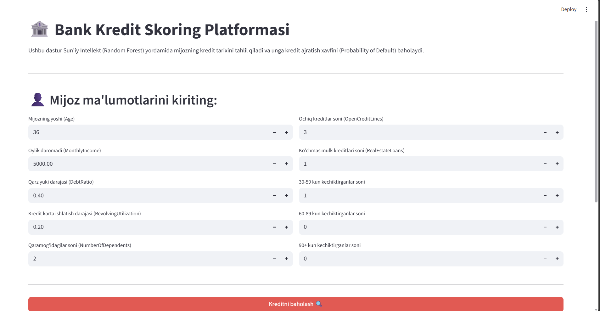
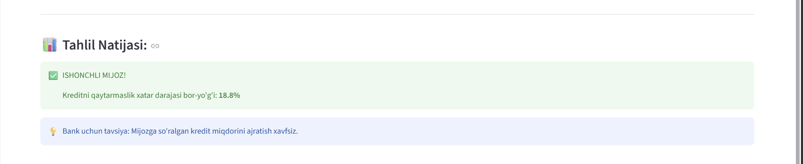

# Bank Credit Scoring System 🏦

A machine learning-powered web application built with Streamlit that analyzes customer credit histories and predicts the Probability of Default using the Random Forest algorithm.

## 🌟 Key Features
- **Customer Profiling:** Analyzes key metrics such as age, monthly income, and debt ratio.
- **Hard Rules Implementation:** Automatically flags and rejects applicants with a history of 90+ days of delinquency.
- **Risk Prediction:** Utilizes a Random Forest classifier to determine the exact probability of credit risk.

## 📊 Model Performance
This model was trained and tested on the Kaggle "Give Me Some Credit" dataset with the following results:
- **Metric:** AUC-ROC
- **Score:** 0.83
- **Status:** Successfully benchmarked on the Kaggle leaderboard.

## 💻 User Interface
![Bank Credit Scoring Platform UI]

